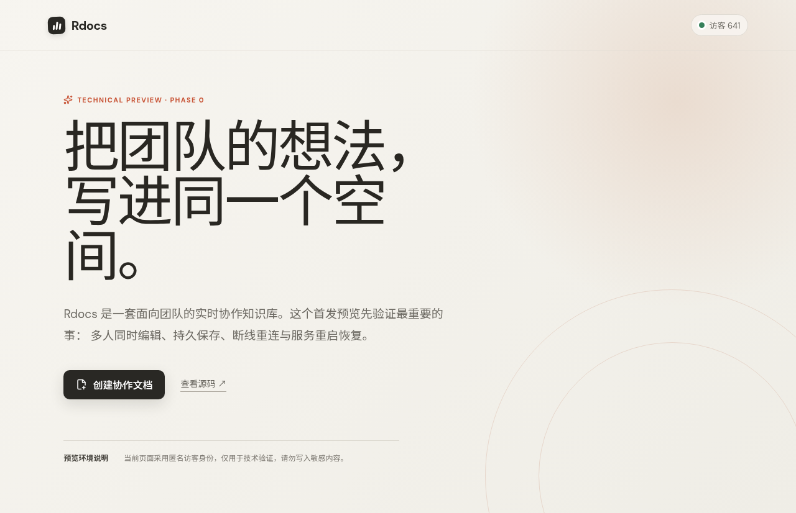

# Rdocs

Rdocs 是一个面向中小团队的多人实时协作知识库。项目以 React、Tiptap、Yjs、D1、R2 和 Durable Objects 为核心，目标部署平台是 **RandallFlare**，正式域名为 `docs.bigrandall.io`。

## 当前状态

当前仓库已经完成 v0.1 的协作文档主链路：

- React + Tiptap 富文本工作台与响应式首页。
- 多组织、设备密钥成员邀请、用户组、空间和可恢复归档。
- 基于 D1 元数据的页面树、移动/排序、回收站和页面级独立 ACL（无权限、只读、读写、管理员）。
- Yjs / y-websocket 兼容协议。
- 浏览器 WebSocket 与应用层 HTTP/Yjs 双通道协作同步。
- 短期 HMAC 协作票据、同源校验和 256 KiB frame 上限。
- 每篇页面、每个 generation 一个 Durable Object。
- DO SQLite 增量持久化、重启恢复和阈值快照。
- 自动/手动版本、预览/比较、R2 不可变快照和幂等的新 generation 安全恢复。
- WebAuthn 设备密钥登记与无用户名登录，不接入 GitHub OAuth，也不保存密码或设备私钥。
- 只存哈希的应用会话、`Secure` / `HttpOnly` Cookie、精确 Origin 校验和自动失效回登录。
- D1 领域模型、恢复操作状态机和版本化迁移。
- 私有 R2 图片/附件、可过期只读分享链接和附件引用安全复制。
- 标题/正文搜索、中文 token、最近访问、收藏、评论、相对锚点和提及；页面通知三档偏好、权限感知去重投递，以及支持已读/归档/批量操作的收件箱。
- generation 隔离的 IndexedDB 离线缓存、模板和 Markdown 导入导出。
- 权限版本检查和已打开连接的撤权关闭路径。
- RandallFlare 部署配置、单文件 Worker 构建和 CI。

应用已部署到 RandallFlare 的正式地址：

<https://docs.bigrandall.io>



`docs.bigrandall.io` 是唯一正式验收域名，旧自动域名已经停用。原生 WebSocket 已在平台修复后的正式域名通过双客户端同步、DO 持久化和重连恢复复验；HTTP/Yjs 恢复通道继续提供无感自动保存、在线状态和协作者光标气泡，详见 [RandallFlare 平台问题清单](docs/RANDALLFLARE_PLATFORM_ISSUES.md)。生产环境已经完成首把真实设备密钥登记并关闭匿名文档空间访问。

完整需求对照见 [Rdocs 实施状态](docs/ROADMAP_STATUS.md)，权限继承与四档矩阵见 [完整权限系统](docs/PERMISSION_SYSTEM.md)，与 Notion、飞书文档和飞书多维表格的边界见 [2026 产品对照](docs/PRODUCT_COMPARISON_2026.md)。

## 架构

```text
Browser
  ├─ HTTPS API ────────── Rdocs Worker ───── D1 / R2
  ├─ HTTP/Yjs fallback ── Rdocs Worker ───── DocumentRoom Durable Object
  └─ WebSocket ────────── Rdocs Worker ────────┘       └─ private SQLite
```

前端构建为单个内联 HTML，再与 API、WebSocket 路由和 DO class 一起打包为一个 ESM Worker，适配 RandallFlare 的 Git build `output file` 部署方式。

仓库结构：

```text
apps/web/          React + Tiptap 编辑器
apps/worker/       HTTP API、协作协议与 DocumentRoom
packages/shared/   前后端共享类型和约束
migrations/        D1 版本化迁移
tests/             线上纵向 smoke test
docs/              架构决策和平台兼容记录
```

## 本地开发

要求 Node.js 20 或更高版本。

```bash
npm install
npm run typecheck
npm test
npm run build
```

前端开发服务器：

```bash
npm run dev -w @rdocs/web
```

完整 Worker 本地运行依赖 RandallFlare 的 `rrangler dev` 与 `workerd`。生产配置位于 [`rrangler.json`](rrangler.json)。

## 部署到 RandallFlare

本项目只通过 `rrangler` 使用 RandallFlare 已有能力，不应修改 RandallFlare 平台代码。

```bash
npm run build
node /develop/bigrandall.io/rrangler/bin/rrangler.mjs deploy --no-publish
npm run migrate:randallflare
node /develop/bigrandall.io/rrangler/bin/rrangler.mjs secret put COLLAB_TICKET_SECRET --worker rdocs
node /develop/bigrandall.io/rrangler/bin/rrangler.mjs secret put PHASE0_ADMIN_SECRET --worker rdocs
node /develop/bigrandall.io/rrangler/bin/rrangler.mjs deploy
```

配置会创建或同步以下 Rdocs 专属资源：

- Worker：`rdocs`
- D1：`rdocs-db`，binding `DB`
- R2：`rdocs-attachments`，binding `ATTACHMENTS`
- Durable Object：binding 与 class 均为 `DocumentRoom`

生产构建命令为 `npm ci && npm run build`，输出文件为 `dist/worker.js`。

设备密钥固定使用 RP ID `docs.bigrandall.io` 和 Origin `https://docs.bigrandall.io`。设备本地生成并保管私钥，服务端只保存公钥；当前生产启用和恢复策略见 [设备密钥启用手册](docs/PASSKEY_SETUP.md)。代码即使收到旧的 `AUTH_MODE=phase0` 配置也会保持设备密钥模式。

## 验证

常规校验：

```bash
npm run format:check
npm run typecheck
npm test
npm run build
```

线上协作闭环：

```bash
RDOCS_SMOKE_ADMIN_SECRET='<secret>' \
RDOCS_SMOKE_URL='https://docs.bigrandall.io' \
RDOCS_SMOKE_ORIGIN='https://docs.bigrandall.io' \
npm run smoke:collab
```

该脚本验证 RandallFlare 原生 WebSocket 链路的双客户端收敛、DO 持久化、重连恢复和在线撤权。浏览器产品界面同时使用 HTTP/Yjs 恢复通道维持无感自动保存，并在 WebSocket 短暂不可用时继续收敛。

没有管理员密钥时，可以显式设置 `RDOCS_SMOKE_SKIP_REVOCATION=1`，仅跳过最后的在线撤权步骤；脚本会在结果中标明跳过项，不会把它误报为通过。

产品主链路 smoke 需要已登记的测试账号和浏览器会话；旧的匿名 smoke 不再适用于生产：

```bash
RDOCS_SMOKE_SESSION_COOKIE='<完整的 __Host-rdocs_session=... Cookie>' \
npm run smoke:product
```

它验证租户发现、页面创建/搜索/最近/收藏、页面权限、评论、私有附件、公开分享与撤销、Markdown、用户组、正式成员邀请、审计和回收站恢复。只应使用隔离的测试账号短期会话，运行后立即退出使 Cookie 失效；当前还应改用两个已登记账号运行浏览器 E2E，不能为了测试重新开放匿名身份。

## 安全边界

生产业务 API 必须持有有效设备密钥会话。新邀请只允许管理员或正式成员；历史 `guest` 只作为外部只读兼容身份保留，不能加入用户组，空间和页面权限都由服务端永久封顶为只读。匿名用户只能持有效分享令牌查看指定页面，不能评论或编辑。完整边界见 [权限系统](docs/PERMISSION_SYSTEM.md)。
